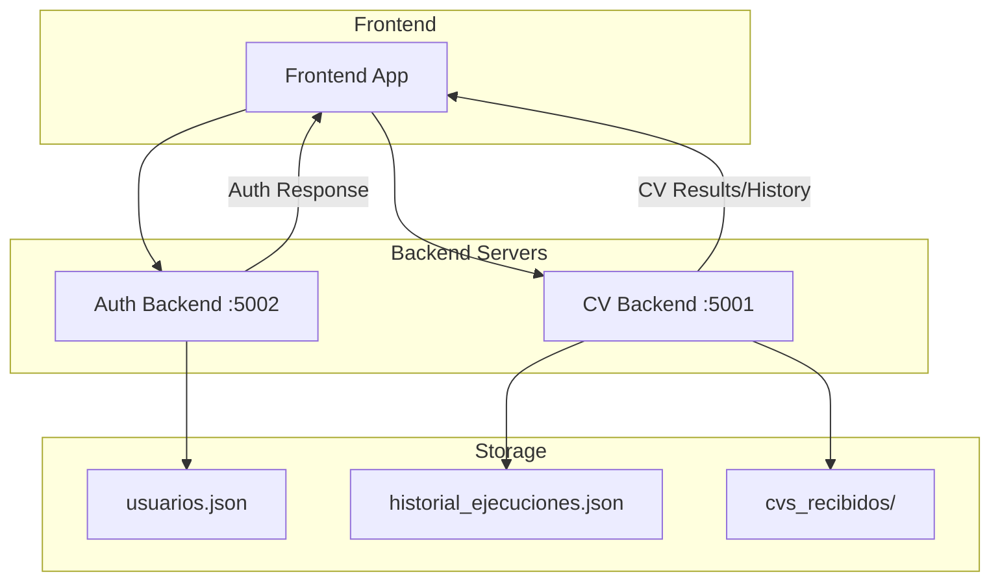

```mermaid
graph TD
    subgraph Frontend
        A[Frontend App]
    end

    subgraph Backend Servers
        B[Auth Backend :5002]
        C[CV Backend :5001]
    end

    subgraph Storage
        D[usuarios.json]
        E[historial_ejecuciones.json]
        F[cvs_recibidos/]
    end

    A --> B;
    A --> C;

    B --> D;

    C --> E;
    C --> F;

    B -- Auth Response --> A;
    C -- CV Results/History --> A;
```
