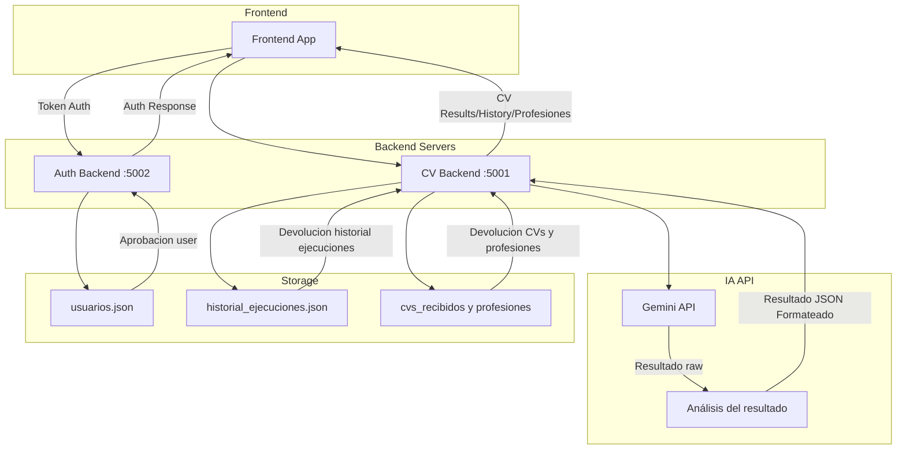

<b>Julian Manuel Garcia Baena</b>

<b>Proyecto CVisualizer</b>

<b>Flujo de trabajo</b>

```mermaid
graph TD
    subgraph Frontend
        A[Frontend App]
    end

    subgraph Backend Servers
        B[Auth Backend :5002]
        C[CV Backend :5001]
    end

    subgraph IA API
        G[Gemini API]
        H[Análisis del resultado]
    end

    subgraph Storage
        D[usuarios.json]
        E[historial_ejecuciones.json]
        F[cvs_recibidos y profesiones]
    end

    A -- Token Auth --> B;
    A --> C;

    B --> D;

    C --> E;
    C --> F;
    C --> G;
    G -- Resultado raw --> H;
    H -- Resultado JSON Formateado --> C;
    D -- Aprobacion user --> B;
    E -- Devolucion historial ejecuciones --> C;
    F -- Devolucion CVs y profesiones--> C;

    B -- Auth Response --> A;
    C -- CV Results/History/Profesiones --> A;
```
